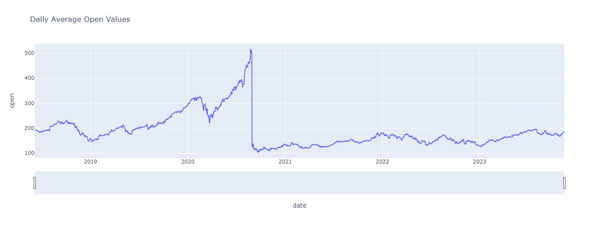
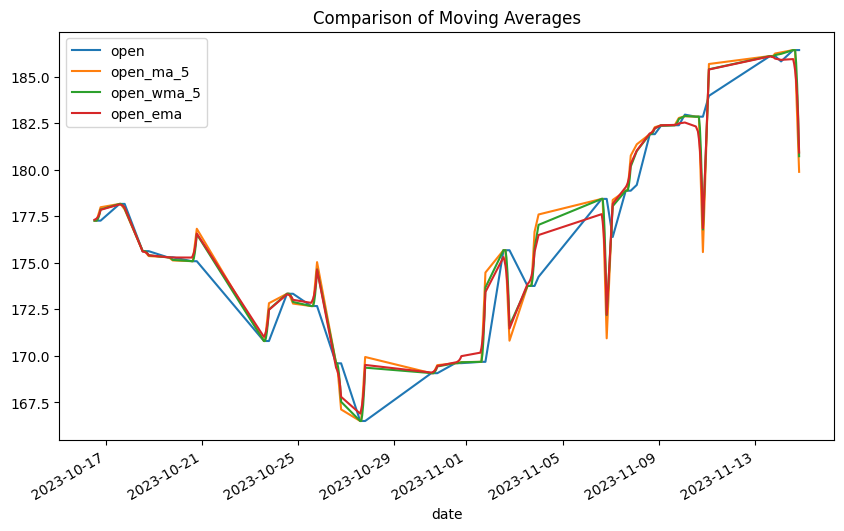
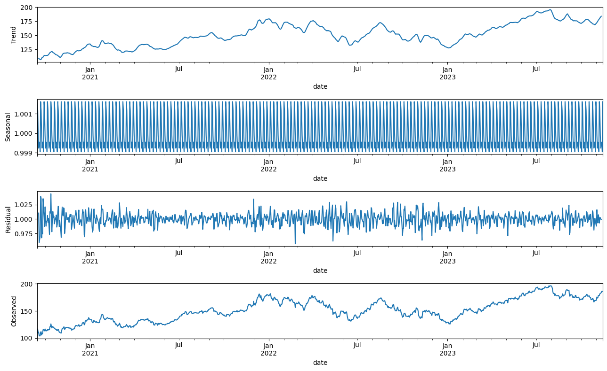
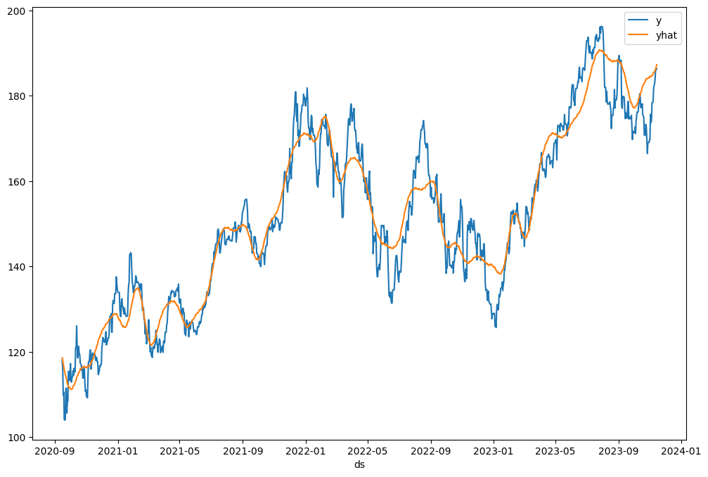

# Stocks Analysis - Time series Forecasting


## Overview

This project aims to analyze intraday stock data for a specific ticker (e.g., AAPL) using the Marketstack API. The analysis includes data extraction scripts and Jupyter notebooks for exploring and preprocessing the data. Time series forecasting is performed using both AutoARIMA and Prophet models.

## Folder Structure

```plaintext
- /data
  - apple_all_data.csv
  - appl_preprocessed_open.csv
  - hourwise_data_preprocessed_appl.csv


- /Notebooks
  - .ipynb_checkpoints [Auto-generated by Jupyter Notebook]
  - DataPreprocessing.ipynb
  - moving_averages_appl_data.ipynb
  - statsTestsDecomposition.ipynb
  - TimeSeriesForecasting.ipynb

- data_extraction.py
- README.md
- LICENSE
- .gitignore
```

## Files

### `data_extraction.py`

This script extracts intraday stock data for a specified ticker (e.g., AAPL) from the Marketstack API. The extracted data is saved to the `apple_all_data.csv` file in the `/data` directory.

#### Usage

1. **Configure API Access Key:**
   - Obtain an API access key from Marketstack.
   - Update the `config.txt` file with the access key.

2. **Run the Script:**
   - Execute the script by running `python data_extraction.py`.
   - The script retrieves intraday data for the specified date range and saves it to `apple_all_data.csv`.


### Jupyter Notebooks in `/Notebooks`

- **DataPreprocessing.ipynb:** 
This notebook focuses on preparing the raw data for in-depth analysis. Techniques such as handling missing values, removing duplicates.
The notebook covers strategies for null value treatment and resampling the data to different time frequencies, providing a clean and structured dataset for further investigation.


- **moving_averages_appl_data.ipynb:** 
This notebook delves into the analysis of moving averages for Apple stock data. Utilizing pandas and plotly, we calculate and visualize various moving averages to identify trends and patterns in the intraday stock prices. This analysis aids in understanding the overall direction of the stock prices and potential points of interest for further investigation.


- **statsTestsDecomposition.ipynb:** 
The statsTestsDecomposition.ipynb notebook is dedicated to conducting statistical tests and time series decomposition. Using tools such as statsmodels and matplotlib, the notebook explores the stationarity of the stock price series and decomposes the time series into its trend, seasonal, and residual components. This analysis is crucial for understanding the underlying patterns and making informed modeling decisions.


- **TimeSeriesForecasting.ipynb:** 
In this notebook, time series forecasting is performed using both AutoARIMA and Prophet models. Leveraging the pmdarima library and Facebook Prophet, we build models to predict future stock prices based on historical data. The notebook provides insights into the accuracy and performance of the forecasting models, offering a glimpse into potential future trends in the intraday stock prices.


